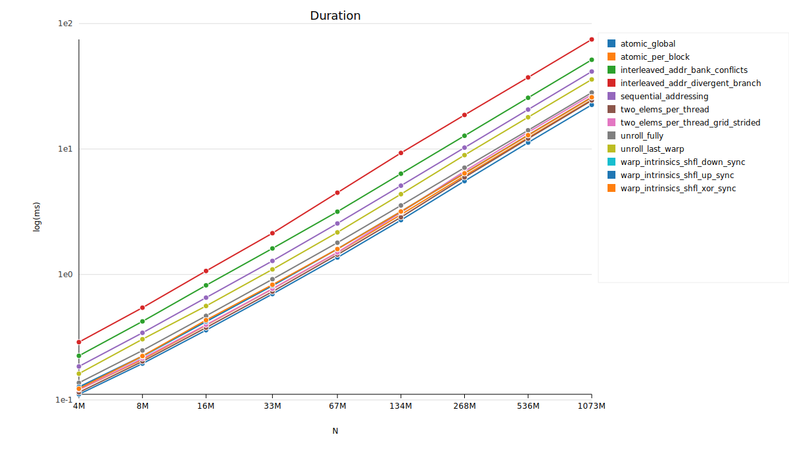
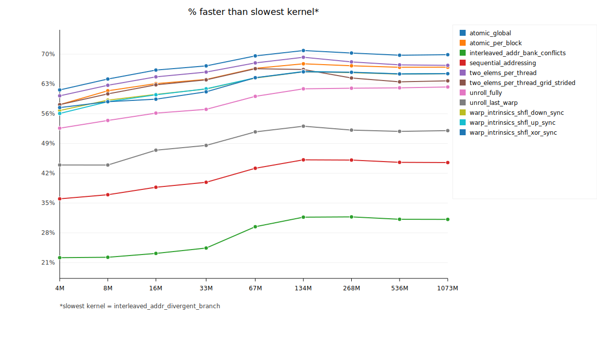
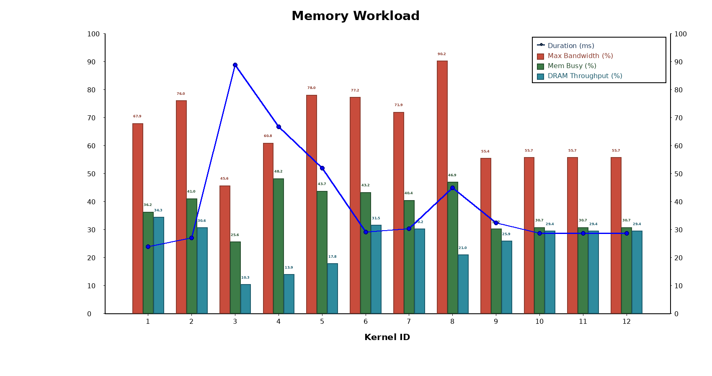
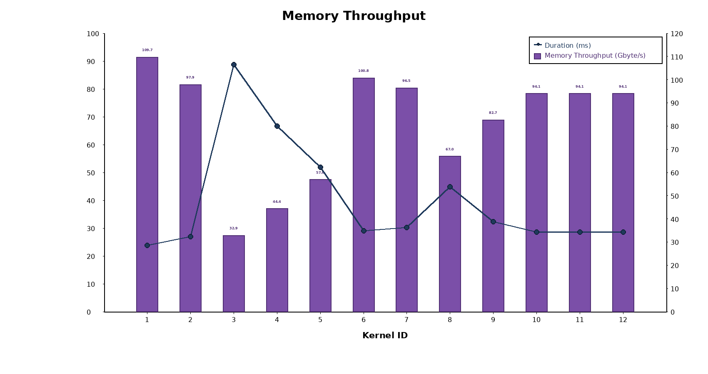
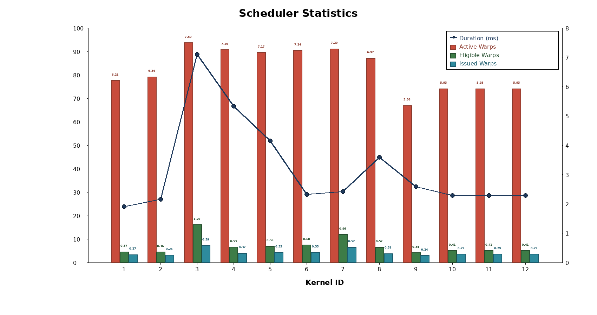
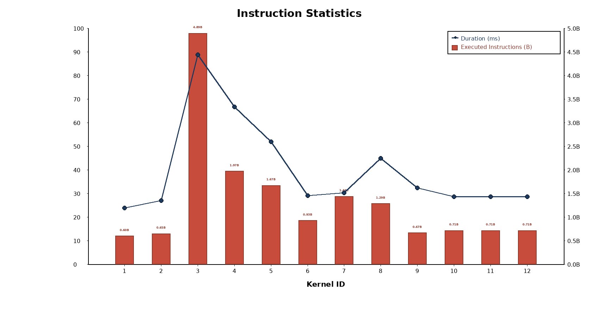
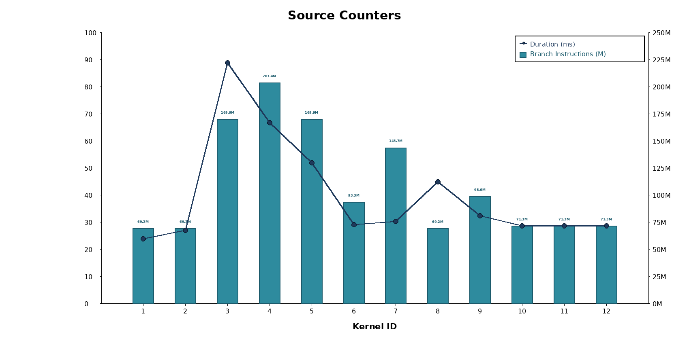

# Profiling Summary

Average execution times (ms) over 15 profiling runs per kernel and array size.

| Kernel | N=4M | N=8M | N=16M | N=33M | N=67M | N=134M | N=268M | N=536M | N=1073M |
|--------------------|--------------------|--------------------|--------------------|--------------------|--------------------|--------------------|--------------------|--------------------|--------------------|
| atomic_global | 0.111 | 0.195 | 0.360 | 0.699 | 1.365 | 2.713 | 5.556 | 11.258 | 22.509 |
| atomic_per_block | 0.121 | 0.210 | 0.394 | 0.767 | 1.496 | 3.003 | 6.116 | 12.312 | 24.704 |
| interleaved_addr_bank_conflicts | 0.225 | 0.423 | 0.820 | 1.613 | 3.168 | 6.360 | 12.756 | 25.615 | 51.450 |
| interleaved_addr_divergent_branch | 0.289 | 0.544 | 1.067 | 2.134 | 4.489 | 9.308 | 18.687 | 37.218 | 74.731 |
| sequential_addressing | 0.185 | 0.343 | 0.654 | 1.283 | 2.551 | 5.105 | 10.259 | 20.632 | 41.467 |
| two_elems_per_thread | 0.115 | 0.203 | 0.377 | 0.730 | 1.439 | 2.860 | 5.946 | 12.102 | 24.383 |
| two_elems_per_thread_grid_strided | 0.121 | 0.214 | 0.397 | 0.769 | 1.500 | 3.128 | 6.653 | 13.587 | 27.106 |
| unroll_fully | 0.137 | 0.248 | 0.468 | 0.917 | 1.792 | 3.551 | 7.102 | 14.112 | 28.183 |
| unroll_last_warp | 0.162 | 0.305 | 0.561 | 1.098 | 2.167 | 4.369 | 8.942 | 17.922 | 35.855 |
| warp_intrinsics_shfl_down_sync | 0.125 | 0.222 | 0.421 | 0.815 | 1.599 | 3.177 | 6.417 | 12.912 | 25.839 |
| warp_intrinsics_shfl_up_sync | 0.127 | 0.224 | 0.422 | 0.814 | 1.596 | 3.171 | 6.398 | 12.885 | 25.828 |
| warp_intrinsics_shfl_xor_sync | 0.123 | 0.224 | 0.433 | 0.829 | 1.595 | 3.178 | 6.403 | 12.897 | 25.848 |

## Profiling Graphs

### Duration vs Array Size (Log Scale)

### % Faster than Slowest Kernel

---

## NCU Analysis Charts (N = 1,073,741,824)

### GPU Speed Of Light Throughput

### Memory Workload

### Memory Throughput (Gbyte/s)

### Scheduler Statistics

### Instruction Statistics

### Source Counters

## Notes

1. No global synchronization (other than coop launch) in cuda  - too expensive to build it on hardware with high number of SMs
2. Coop launch allows only max device block count blocks to be used - i.e. very small number. If your input requires more blocks => serialization
3. Hence multi pass is used for the reduction kernel
4. Reductions have very low AI - 1 FLOP per input element => the aim here should be to maximize bandwidth
5. Possible bottlenecks are instruction overheads - anything that is not L, S or calculation for the final result

