# Nsight Compute - Detailed Analysis

**Kernels profiled:** [interleaved_addr_divergent_branch.cu](kernels/interleaved_addr_divergent_branch.cu) (base, inferior kernel) and [atomic_global.cu](kernels/atomic_global.cu) (superior kernel).

## Kernel Details

We profile the best vs the worst performing kernel from our collection in `kernels`.

The name `atomic_global.cu` can be slightly misleading: this kernel still uses SRAM as an intermediate step for the final `atomicAdd`. However, unlike `atomic_per_block.cu`, it loads each input value directly from DRAM into a register instead of first staging a chunk of input data in SRAM.

### Result

`3.7x` speedup for an input of `N=1,070 M` — down from `89 ms` to `24 ms`.

## Profiling results

### Bottlenecks

Below are the most urgent bottlenecks for both kernels. 
Even though `atomic` has a measured `3.7x` speedup, Nsight Compute reports:
- an estimated speedup of `64%` for `atomic` and only `75%` for `interleaved` (expected to be much higher)
- a higher estimated speedup from `L1TEX Global Store` for `atomic` (`64%`) than for `interleaved` (`45%`) (arguably counterintuitive)

This indicates that Nsight Compute guidance should be interpreted carefully and validated against measured runtime.

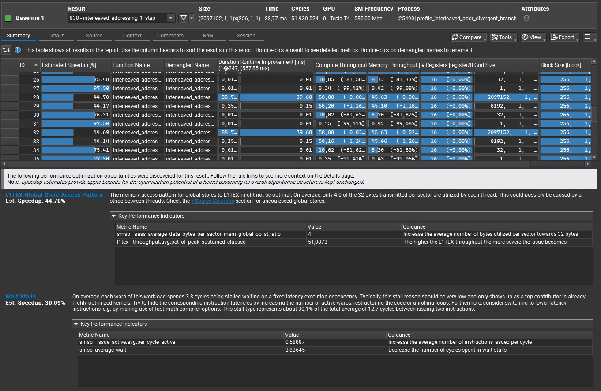

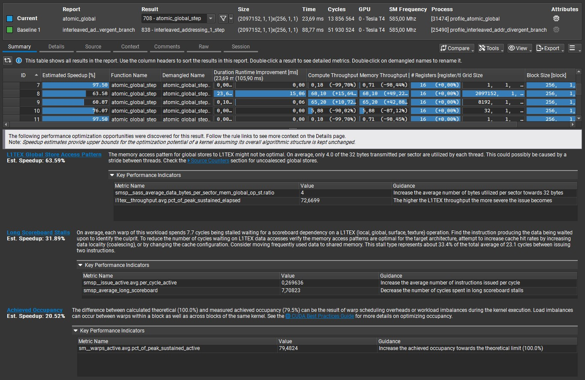

## Comparative Analysis

### Compute vs Memory Throughput

Memory throughput increases by `50%`, while DRAM throughput (the most critical metric here) improves by `3.3x`. Compute throughput also increases by `15%`, but this is less important for a low-arithmetic-intensity workload.

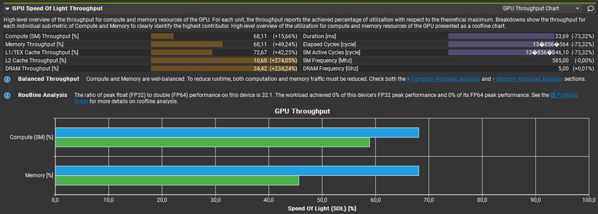

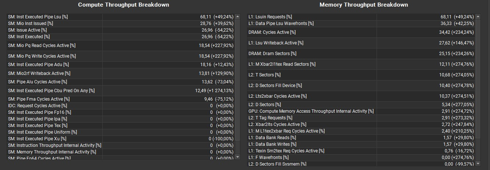

### Compute Workload

Instructions per cycle drop by more than `50%`. `% of peak SM throughput` (`SM Busy`) also drops by more than `50%`, yet performance still improves significantly.

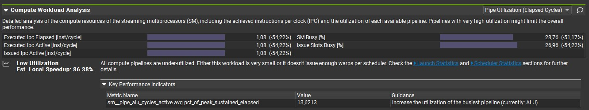

### Instructions

Issued/executed instruction counts drop by almost `90%`.

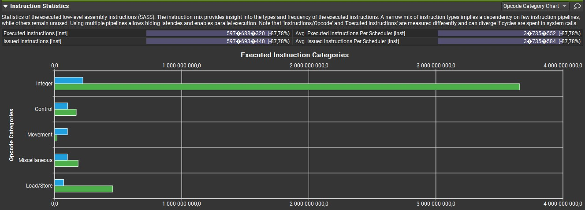

### Memory Workload

Data moving significantly faster in `atomic`, which is what matters for Parallel Reduction:
- Memory Throughput increases from `33` to `110 Gbyte/s`
- Throughput within DRAM + caches (`Mem Busy`) increases by `42%`
- Throughput on interconnects between SMs, caches, and DRAM (`Max Bandwidth`) also improves
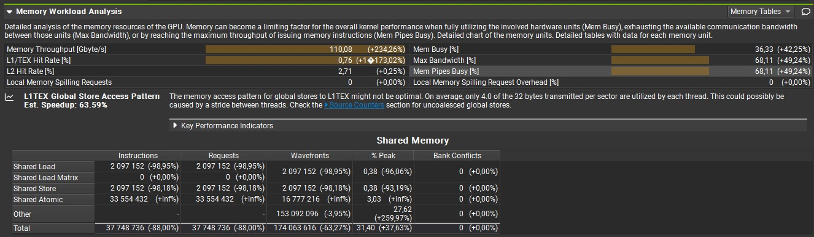

Load/Store throughput within DRAM up by 234% / 264% respectively.

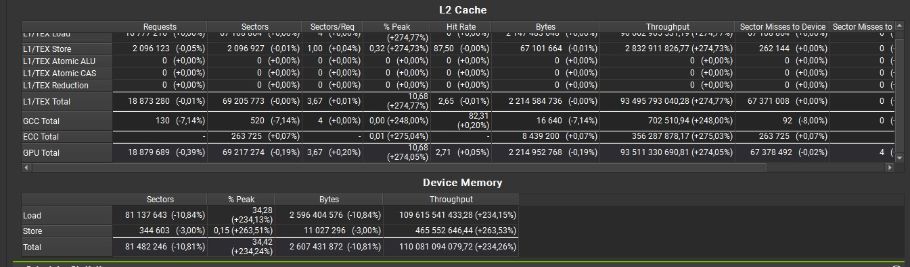

### GPU & Memory Workload Distribution

Average DRAM active cycles went down by only 11%, while other average active cycle types decreased by 52-73%.

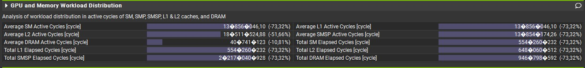

### Scheduler Statistics

Another example (also seen in other projects) where occupancy decreases (`Eligible` down `71%`, `Issued` down `54%`), yet performance improves due to factors more relevant to this kernel workflow — in this case, DRAM throughput.

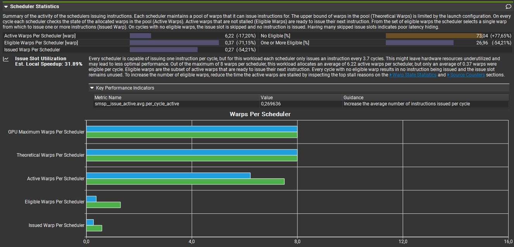

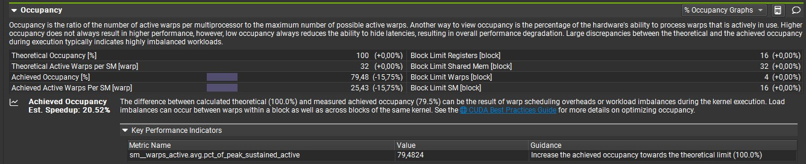

### Warp State Statistics

Warps now wait `81%` longer between consecutive instructions, yet overall performance is still `3.7x` better.

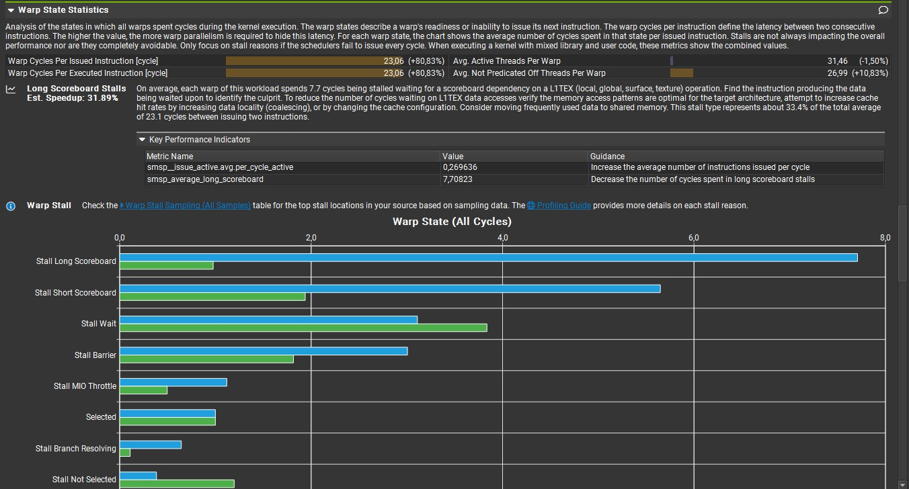

### Launch Statistics

Launch statistics are identical for both kernels and are included here for reference.

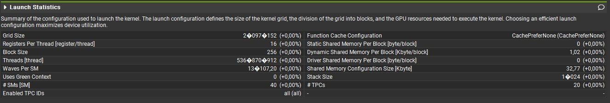

### Source Code Analysis

As expected, the `atomicAdd` line is responsible for the largest share of stalls, as shown in both PTX and SASS views.

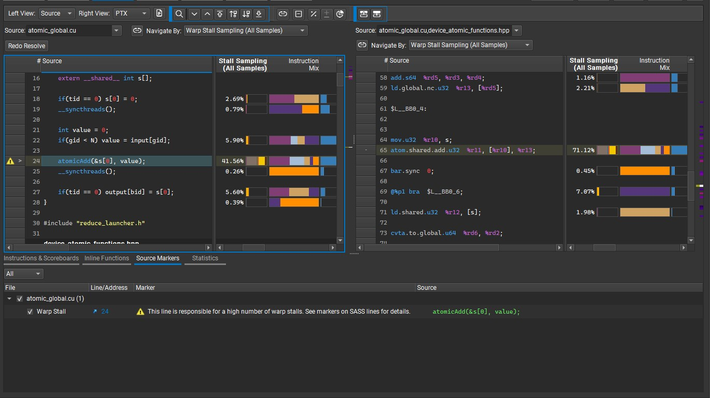

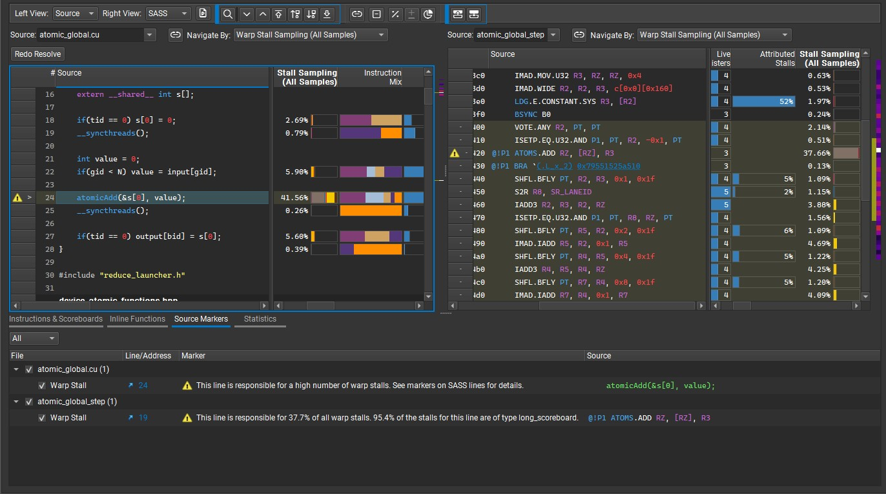